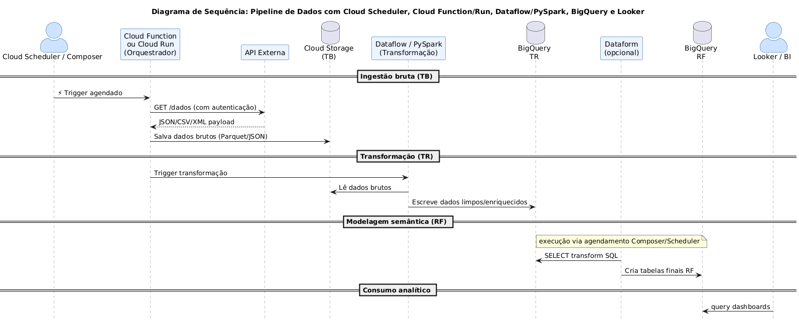
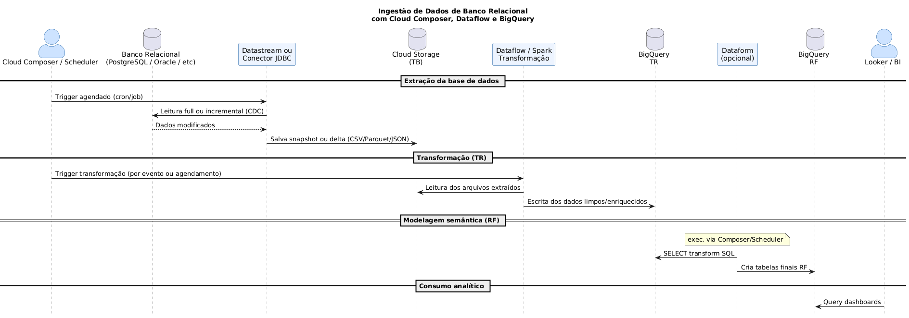
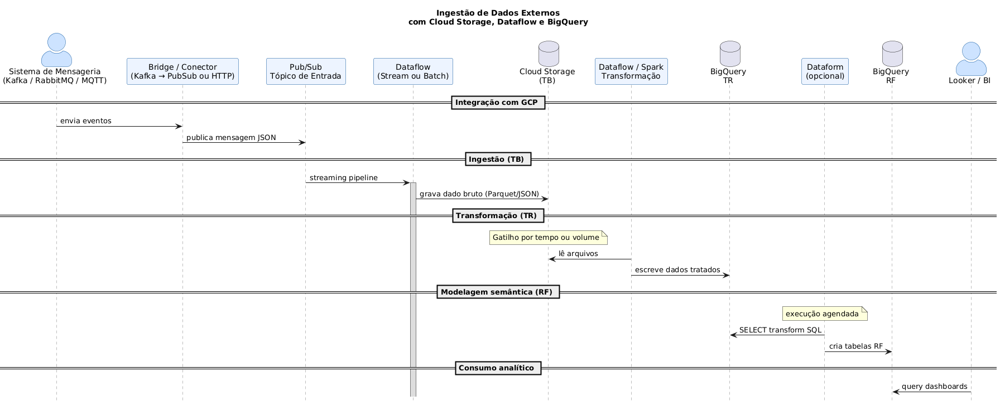
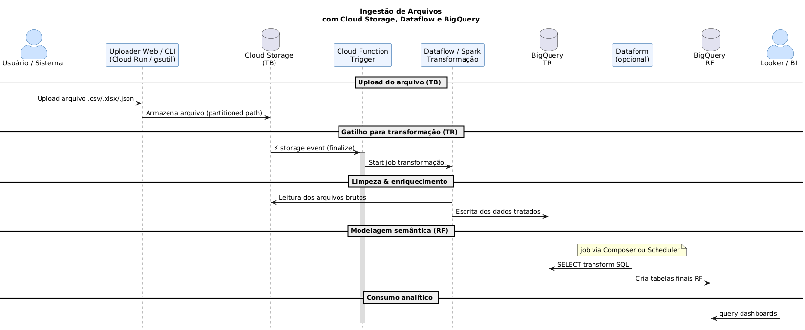

# Airflow

## Tipos de Fontes de Ingestão de Dados (Sources)

| Tipo de Fonte           | Exemplos de Origem                          | Estratégia de Ingestão        | Ferramentas GCP Recomendadas                                          |
|-------------------------|---------------------------------------------|-------------------------------|------------------------------------------------------------------------|
| **Streaming (eventos)** | Kafka, Pub/Sub, IoT Devices, Logs           | Ingestão contínua (real-time) | Pub/Sub, Dataflow (streaming), IoT Core *(deprecated)*                |
| **API externa**         | APIs REST, SOAP, GraphQL                    | Agendamento / polling         | Cloud Scheduler + Cloud Run / Cloud Functions                         |
| **Arquivos em storage** | Cloud Storage, SFTP, buckets externos       | Event-driven ou batch         | Cloud Storage, Eventarc, Storage Transfer Service                     |
| **Banco relacional**    | MySQL, PostgreSQL, Oracle, SQL Server       | Replicação / CDC              | Datastream, Dataflow (JDBC), Cloud SQL, BigQuery Federation           |
| **Data warehouses**     | Snowflake, Redshift, Teradata               | Export/Import programado      | BigQuery Transfer Service, Cloud Functions, Storage Import            |
| **Arquivos locais**     | CSV/Excel locais, diretórios SFTP/FTP       | Upload manual ou integração   | Storage Transfer Service, Cloud Run (upload handler)                  |
| **SaaS (aplicações)**   | Salesforce, Google Ads, SAP, GA4            | Conectores gerenciados        | BigQuery Data Transfer Service, Airbyte, Fivetran                     |
| **Mensageria externa**  | Kafka, RabbitMQ, MQTT                       | Conector ou bridge            | Pub/Sub Kafka connector, Dataflow, Confluent Cloud                    |
| **Logs e métricas**     | Stackdriver, Prometheus, ELK, Datadog       | Streaming ou export batch     | Logging export → Pub/Sub, Ops Agent, Monitoring API                   |
| **Emails e anexos**     | Caixas de e-mail (IMAP/SMTP)                | Polling e parsing de anexos   | Gmail API + Cloud Functions + Cloud Storage                           |

#### API externa



#### Arquivos em storage


#### Banco relacional



#### Mensageria externa



#### Arquivos locais



#### SaaS (aplicações)


#### Streaming (eventos)


## Classificação por Modo de Ingestão

| Modo de Ingestão | Fontes Comuns                                      |
|------------------|----------------------------------------------------|
| **Streaming**     | Pub/Sub, Kafka, IoT, Logs                          |
| **Batch (lote)**  | Arquivos, bancos, SaaS, API                        |
| **CDC (change data capture)** | Bancos relacionais, ERP (SAP)                  |
| **Event-driven**  | Storage (object finalized), Pub/Sub, Webhooks     |
| **Manual/Híbrido**| Upload manual, coleta por agendamento              |


## Pre-req

Docker & Docker Compose - https://docs.docker.com/compose/install/

## Airflow in Docker

https://airflow.apache.org/docs/apache-airflow/stable/howto/docker-compose/index.html

### Usage

#### Run Airflow

```
make install_airflow
make run
```

#### Dags

```
./dags
```

#### Web Interface

http://localhost:8080

* user: airflow 
* password: airflow

####  Sending requests to the REST API

```
ENDPOINT_URL="http://localhost:8080/"
curl -X GET  \
    --user "airflow:airflow" \
    "${ENDPOINT_URL}/api/v1/pools"
```    

### Uninstall

#### Remove all

```
make clean_up
```

## References

- https://airflow.apache.org/docs/apache-airflow/stable/howto/docker-compose/index.html
- https://sistemas-operacionais.github.io/docker/docker-compose.html
- https://brilliantprogrammer.medium.com/how-to-trigger-airflow-dag-using-rest-api-dd40e3f7a30d
- https://github.com/pipeline-tools/gusty
- https://pipeline-tools.github.io/gusty-docs/
- https://github.com/pipeline-tools/gusty-demo
- https://downloads.apache.org/airflow/providers/
- https://airflow.apache.org/docs/


- https://airflow.apache.org/docs/apache-airflow-providers-google/stable/index.html

- https://www.astronomer.io/docs/astro/cli/install-cli
- https://www.astronomer.io/docs/software/customize-image
- https://www.astronomer.io/docs/astro/runtime-release-notes
- https://www.astronomer.io/docs/software/runtime-image-architecture
